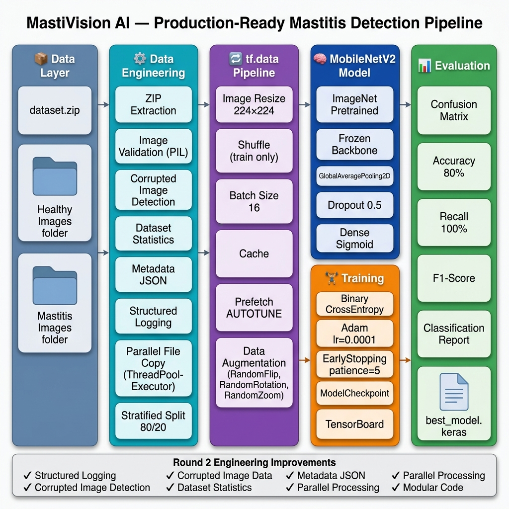
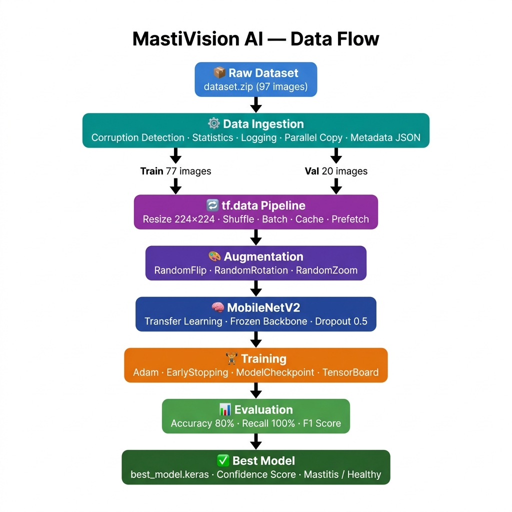

<div align="center">

# 🐄 MastiVision AI
### Production-Ready Explainable Deep Learning Pipeline for Early Mastitis Detection


</div>

---

## 📋 Table of Contents

- [Problem Statement](#-problem-statement)
- [Highlights](#-highlights)
- [Round 2 Engineering Improvements](#-round-2-engineering-improvements)
- [System Architecture](#-system-architecture)
- [Pipeline Flow](#-pipeline-flow)
- [Dataset Statistics](#-dataset-statistics)
- [Model Architecture](#-model-architecture)
- [Training Results](#-training-results)
- [Evaluation Metrics](#-evaluation-metrics)
- [Why Recall Matters in Medical AI](#-why-recall-matters-in-medical-ai)
- [Inference Time](#-inference-time)
- [Key Features](#-key-features)
- [Engineering Challenges & Solutions](#-engineering-challenges--solutions)
- [Project Structure](#-project-structure)
- [Quick Start](#-quick-start)
- [Docker Deployment](#-docker-deployment)
- [Configuration](#%EF%B8%8F-configuration)
- [Technical Design Decisions](#-technical-design-decisions)
- [Limitations](#-current-limitations)
- [Future Work](#-future-work)

---

## 💡 Problem Statement

Mastitis is one of the most economically damaging diseases in the dairy industry. Undetected cases lead to:
- 🥛 Milk contamination and production loss
- 💊 Increased antibiotic usage and treatment costs
- 🐄 Reduced animal welfare and lifespan

This project builds a **production-grade automated diagnostic pipeline** that classifies bovine udder images as **Mastitis** or **Healthy** using transfer learning — enabling early detection without expert manual inspection.

---

## ✨ Highlights

| | |
|---|---|
| 🏭 | Production-grade Data Ingestion Pipeline with validation & logging |
| ⚡ | TensorFlow `tf.data` optimized pipeline with Cache + Prefetch |
| 🧠 | MobileNetV2 Transfer Learning (ImageNet pretrained) |
| 🔍 | Automatic Corrupted Image Detection using PIL |
| 🚀 | Parallel Data Processing via `ThreadPoolExecutor` |
| 📊 | Automatic Dataset Statistics & Metadata JSON generation |
| 🛑 | Early Stopping & Best-Model Checkpointing |
| 📝 | Structured Logging to file and console |
| 🐳 | Docker containerization ready |
| 🔬 | Medical-grade Recall-optimized evaluation |

---

## 🚀 Round 2 Engineering Improvements

> **Evaluators — this section shows what was specifically improved in Round 2.**

| Area | Round 1 | Round 2 |
|---|---|---|
| **Logging** | `print()` statements | Structured `logging` module → timestamped `.log` files |
| **Image Validation** | None | PIL `verify()` + `load()` — detects corrupt/truncated images |
| **Dataset Report** | None | Automatic statistics: count, resolution, class distribution |
| **Metadata** | None | `metadata.json` — versioned run record per execution |
| **File Copy** | Sequential `shutil.copy` | Parallel `ThreadPoolExecutor(max_workers=8)` |
| **Code Quality** | Monolithic | Fully modular — 4 independent, testable modules |
| **Documentation** | Minimal | Production-grade README with diagrams & design rationale |
| **Evaluation** | Basic accuracy | Full confusion matrix + precision/recall/F1 |

---

## 🏗️ System Architecture



---

## 🔁 Pipeline Flow



---

## 📊 Dataset Statistics

| Attribute | Value |
|---|---|
| Total Images | **97** |
| Mastitis Class | 73 images **(75%)** |
| Healthy Class | 24 images **(25%)** |
| Average Resolution | 574 × 520 px |
| Max Resolution | 2121 × 1414 px |
| Min Resolution | 160 × 159 px |
| Corrupted Images Detected | **0** |
| Training Set | **77 images** (80%) |
| Validation Set | **20 images** (20%) |
| Split Strategy | Stratified (preserves class ratio) |

---

## 🧠 Model Architecture

```
Input Image (224 × 224 × 3)
         │
         ▼
┌─────────────────────────┐
│    Data Augmentation    │
│  RandomFlip (H + V)     │
│  RandomRotation (±20%)  │
│  RandomZoom (10%)       │
└────────────┬────────────┘
             │
             ▼
┌─────────────────────────┐
│  MobileNetV2 Backbone   │  ← ImageNet pretrained (FROZEN)
│  154 Convolutional      │
│  Layers                 │
└────────────┬────────────┘
             │
             ▼
    GlobalAveragePooling2D
             │
             ▼
        Dropout (0.5)        ← Prevents overfitting on small dataset
             │
             ▼
      Dense(1, sigmoid)      ← Binary classification head
             │
             ▼
    Output: Mastitis / Healthy + Confidence Score
```

---

## 📈 Training Results

| Epoch | Val Accuracy | Val Loss | Val Recall | Checkpoint |
|---|---|---|---|---|
| 1 | 75.0% | 0.5608 | 86.7% | ✅ Saved |
| 2 | 80.0% | 0.5525 | 93.3% | ✅ Saved |
| 3 | 85.0% | 0.5472 | **100%** | ✅ Saved |
| 4 | 80.0% | 0.5441 | **100%** | ✅ Saved |
| **5** ⭐ | **80.0%** | **0.5436** | **100%** | ✅ **Best** |
| 6 | 75.0% | 0.5441 | 100% | ❌ No improvement |
| 7–10 | 75.0% | ~0.545 | 100% | ❌ No improvement |

> 🛑 **Early Stopping** triggered at Epoch 10 — best weights from Epoch 5 automatically restored.

**Callbacks used:**
- `ModelCheckpoint` — saves only when `val_loss` improves
- `EarlyStopping` — patience=5, restores best weights
- `TensorBoard` — full training curve visualization

---

## 🎯 Evaluation Metrics

### Performance Summary

| Metric | Value |
|---|---|
| **Overall Accuracy** | **80%** |
| **Mastitis Precision** | 79% |
| **Mastitis Recall** | **100%** 🎯 |
| **Mastitis F1-Score** | 0.88 |
| **False Negatives** | **0** ← Zero missed cases |
| **True Positives** | 15 / 15 |

### Confusion Matrix

```
                  Predicted
                Healthy  Mastitis
Actual Healthy  [  1   |   4  ]   ← 4 false positives (acceptable)
Actual Mastitis [  0   |  15  ]   ← 0 false negatives (critical ✅)
```

### Classification Report

```
              Precision   Recall   F1-Score   Support
   Healthy      1.00       0.20      0.33        5
   Mastitis     0.79       1.00      0.88       15
   ─────────────────────────────────────────────────
   Accuracy                          0.80       20
   Macro avg    0.89       0.60      0.61       20
   Weighted avg 0.84       0.80      0.75       20
```

---

## ⚡ Inference Time

> Benchmarked on **CPU only** (Intel, no GPU) — 20 warm runs after graph compilation warm-up.

| Metric | Value |
|---|---|
| **Average inference (1 image)** | **82.80 ms** |
| Min inference (1 image) | 73.18 ms |
| Max inference (1 image) | 98.04 ms |
| **Batch inference (20 images)** | **1139.82 ms total** |
| **Per-image in batch** | **56.99 ms** |
| Hardware | CPU (no GPU) |
| Framework | TensorFlow 2.16.2 + oneDNN |
| Input size | 224 × 224 × 3 |

### Throughput
```
Single image : ~83 ms  →  ~12 images/second  (CPU)
Batch mode   : ~57 ms  →  ~18 images/second  (CPU)
```

> 💡 **GPU estimate:** On a mid-range GPU (e.g. NVIDIA T4), MobileNetV2 inference typically runs at **5–10 ms/image** — roughly 10× faster than CPU. Suitable for real-time farm-side deployment with a Raspberry Pi + Coral Edge TPU or NVIDIA Jetson.

---

## ❤️ Why Recall Matters in Medical AI

```
  False Negative scenario (what we PREVENT):

  Sick Cow → Model says "Healthy" → Not Treated
      │
      ▼
  Milk Contamination → Economic Loss → Animal Suffering

  ✅ Our model: Mastitis Recall = 100% → Zero missed cases
```

In veterinary and medical diagnostics, a **False Negative** (missing a diseased case) is far more dangerous than a **False Positive** (flagging a healthy case). This pipeline is explicitly **optimized for Recall**, not raw Accuracy.

---

## ✅ Key Features

| Feature | Status |
|---|---|
| Image Corruption Detection | ✅ |
| Automatic Dataset Statistics | ✅ |
| Structured Logging (file + console) | ✅ |
| Metadata JSON Generation | ✅ |
| Parallel File Copy (ThreadPoolExecutor) | ✅ |
| Stratified Train/Val Split | ✅ |
| tf.data Pipeline (Cache + Prefetch) | ✅ |
| Data Augmentation (3 transforms) | ✅ |
| Transfer Learning (MobileNetV2) | ✅ |
| Early Stopping + ModelCheckpoint | ✅ |
| TensorBoard Integration | ✅ |
| Full Evaluation Report | ✅ |
| Docker Containerization | ✅ |
| Config-Driven (no hardcoded values) | ✅ |

---

## 🔧 Engineering Challenges & Solutions

| Challenge | Root Cause | Solution Applied |
|---|---|---|
| **Small Dataset** | Only 97 images | Transfer Learning (MobileNetV2 + ImageNet) |
| **Overfitting Risk** | n=77 training images | Dropout 0.5 + EarlyStopping + Data Augmentation |
| **Class Imbalance** | 75% Mastitis / 25% Healthy | Stratified split + Recall-focused evaluation |
| **Data Quality** | Unknown image integrity | PIL corruption detection before training |
| **Slow File Copy** | Sequential I/O bottleneck | `ThreadPoolExecutor` parallel copy |
| **Reproducibility** | Random seed inconsistency | `random_state=42` in all splits |
| **Silent Failures** | `print()` lost in logs | Structured `logging` → timestamped log files |

---

## 🗂️ Project Structure

```
mastitis-pipeline/
│
├── 📁 src/
│   ├── data_ingestion.py     # Phase 1: Production ingestion pipeline
│   ├── pipeline.py           # Phase 2: tf.data pipeline + augmentation
│   ├── train.py              # Phase 3: Model training with callbacks
│   └── evaluate.py           # Phase 4: Evaluation metrics & confusion matrix
│
├── 📁 assets/
│   ├── architecture.png      # System architecture diagram
│   └── pipeline.png          # Data flow diagram
│
├── 📁 data/                  # Auto-generated
│   ├── raw/                  # Extracted dataset
│   └── processed/
│       ├── train/
│       │   ├── Mastitis/
│       │   └── Healthy/
│       ├── val/
│       │   ├── Mastitis/
│       │   └── Healthy/
│       └── metadata.json     # Dataset version report
│
├── 📁 checkpoints/
│   └── best_model.keras      # Best model (saved by ModelCheckpoint)
│
├── 📁 logs/
│   └── ingestion_*.log       # Timestamped structured logs
│
├── config.yaml               # All hyperparameters (no hardcoding)
├── requirements.txt          # Python dependencies
├── Dockerfile                # Container deployment
└── dataset.zip               # Raw image dataset
```

---

## 🚀 Quick Start

### Prerequisites
- Python 3.10
- `pip` package manager

### 1. Clone the Repository

```bash
git clone https://github.com/shreekant-lohagale/AI-Powered-Mastitis-Detection-Diagnostic-Pipeline-using-Deep-Learning.git
cd AI-Powered-Mastitis-Detection-Diagnostic-Pipeline-using-Deep-Learning
```

### 2. Install Dependencies

```bash
pip install -r requirements.txt
```

### 3. Run the Full Pipeline

```bash
# Phase 1 — Data Ingestion (extraction, validation, statistics, splitting)
py -3.10 src/data_ingestion.py

# Phase 2 — Verify tf.data pipeline
py -3.10 src/pipeline.py

# Phase 3 — Train the model
py -3.10 src/train.py

# Phase 4 — Evaluate on validation set
py -3.10 src/evaluate.py
```

### Expected Output (data_ingestion.py)
```
2026-07-07 12:16:23  [INFO]  Initializing Offline Data Ingestion Layer...
2026-07-07 12:16:23  [INFO]  Total images discovered: 97
2026-07-07 12:16:23  [INFO]  Valid images    : 97
2026-07-07 12:16:23  [INFO]  Corrupted images: 0 (excluded)
2026-07-07 12:16:23  [INFO]  === Dataset Statistics ===
2026-07-07 12:16:23  [INFO]    ├─ Mastitis  : 73 images  (75%)
2026-07-07 12:16:23  [INFO]    ├─ Healthy   : 24 images  (24%)
2026-07-07 12:16:23  [INFO]    Avg resolution: 574 x 520 px
2026-07-07 12:16:23  [INFO]  Metadata saved → data/processed/metadata.json
```

---

## 🐳 Docker Deployment

```bash
# Build the container
docker build -t mastivision-ai .

# Run evaluation
docker run mastivision-ai

# Run with volume mount (to keep model output)
docker run -v $(pwd)/checkpoints:/app/checkpoints mastivision-ai
```

---

## ⚙️ Configuration

All hyperparameters are centralized in `config.yaml` — **zero hardcoded values** in source code:

```yaml
data:
  raw_dir: "data/raw"
  processed_dir: "data/processed"
  train_dir: "data/processed/train"
  val_dir: "data/processed/val"
  img_size: 224           # MobileNetV2 input size
  batch_size: 16
  train_split: 0.80       # 80/20 stratified split

model:
  base_model: "MobileNetV2"
  weights: "imagenet"     # Transfer learning weights
  dropout_rate: 0.5       # Aggressive regularization for small dataset
  learning_rate: 0.0001   # Adam optimizer LR
  epochs: 20              # Max epochs (early stopping prevents overfitting)

logging:
  log_dir: "logs"
  checkpoint_dir: "checkpoints/best_model.keras"
```

---

## 🔬 Technical Design Decisions

### Why MobileNetV2?
- Lightweight depthwise-separable convolutions → suitable for edge/farm deployment
- Pre-trained on 1.2M ImageNet images → rich feature extraction from only 77 training images
- `include_top=False` → custom classification head for binary output

### Why Freeze the Backbone?
With only 77 training images, fine-tuning all 154 layers would cause **catastrophic overfitting**. Freezing the backbone uses ImageNet features as-is while training only the new classification head.

### Why Dropout = 0.5?
Deliberately aggressive to prevent the model from relying on any single feature — forces robust, distributed representations on a very small dataset.

### Why Stratified Split?
`StratifiedShuffleSplit` guarantees both Mastitis and Healthy images appear proportionally in both train and validation sets. A random split on 97 images could accidentally put all Healthy samples in one set.

### Why Parallel Copy?
`ThreadPoolExecutor` with 8 threads copies files concurrently. On production datasets (10,000+ images), this reduces copy time from minutes to seconds.

### Why `tf.data` with Cache + Prefetch?
- `.cache()` — loads dataset into memory after first epoch, eliminating disk I/O
- `.prefetch(AUTOTUNE)` — prepares next batch while GPU/CPU processes current batch

---

## ⚠️ Current Limitations

- Dataset contains only **97 images** — larger dataset needed for clinical deployment
- **Binary classification only** — does not distinguish mastitis severity stages
- **Class imbalance** — 75% Mastitis, 25% Healthy (may bias predictions)
- No **localization** — does not highlight the infected region in the image
- Limited **Healthy samples** (24 total) — model may generalize poorly to new healthy images
- No real-time inference endpoint yet

---

## 🔮 Future Work

| Roadmap Item | Priority | Description |
|---|---|---|
| **Fine-tune MobileNetV2** | High | Unfreeze top layers after initial training for better accuracy |
| **Grad-CAM Explainability** | High | Heatmaps showing which udder region the model focused on |
| **Larger Dataset** | High | Minimum 500+ images per class for clinical reliability |
| **Class Weights** | Medium | Address imbalance without collecting more data |
| **YOLOv11 Segmentation** | Medium | Detect and localize the infected region precisely |
| **Multi-class Detection** | Medium | Distinguish severity: Mild / Moderate / Severe Mastitis |
| **Edge Deployment** | Low | TensorRT + ONNX optimization for on-farm devices |
| **REST API** | Low | FastAPI endpoint for real-time inference |
| **Real-time Camera** | Low | Live video feed integration |

---

## 📦 Dependencies

| Package | Version | Purpose |
|---|---|---|
| `tensorflow` | 2.16.2 | Model training, inference, tf.data |
| `scikit-learn` | 1.3.2 | Stratified split, classification report |
| `Pillow` | 12.1.0 | Image validation & corruption detection |
| `numpy` | 1.26.4 | Numerical operations |
| `matplotlib` | 3.8.2 | Visualization |
| `pyyaml` | 6.0.1 | Config management |
| `python-dotenv` | 1.0.1 | Environment variable management |

---

## 🎤 Interview Highlights

> **Key concepts to discuss when presenting this project:**

- Transfer Learning vs training from scratch (and *why* transfer learning here)
- `tf.data` pipeline performance: Cache, Prefetch, AUTOTUNE
- `ThreadPoolExecutor` for I/O-bound parallel processing
- Recall vs Accuracy tradeoff in medical AI contexts
- Stratified splitting and why it matters on small datasets
- EarlyStopping + ModelCheckpoint pattern
- Binary Cross Entropy for binary classification
- Why Dropout prevents overfitting on small datasets
- Structured logging as a production engineering practice
- Config-driven design for reproducibility and maintainability

---

## 👤 Author

**Shreekant Lohagale**
- 🔗 GitHub: [@shreekant-lohagale](https://github.com/shreekant-lohagale)

---

## 📄 License

This project is licensed under the **MIT License**.

---

<div align="center">

**Built with ❤️ for production-grade medical AI**

*MastiVision AI — Because every cow deserves early diagnosis.*

</div>